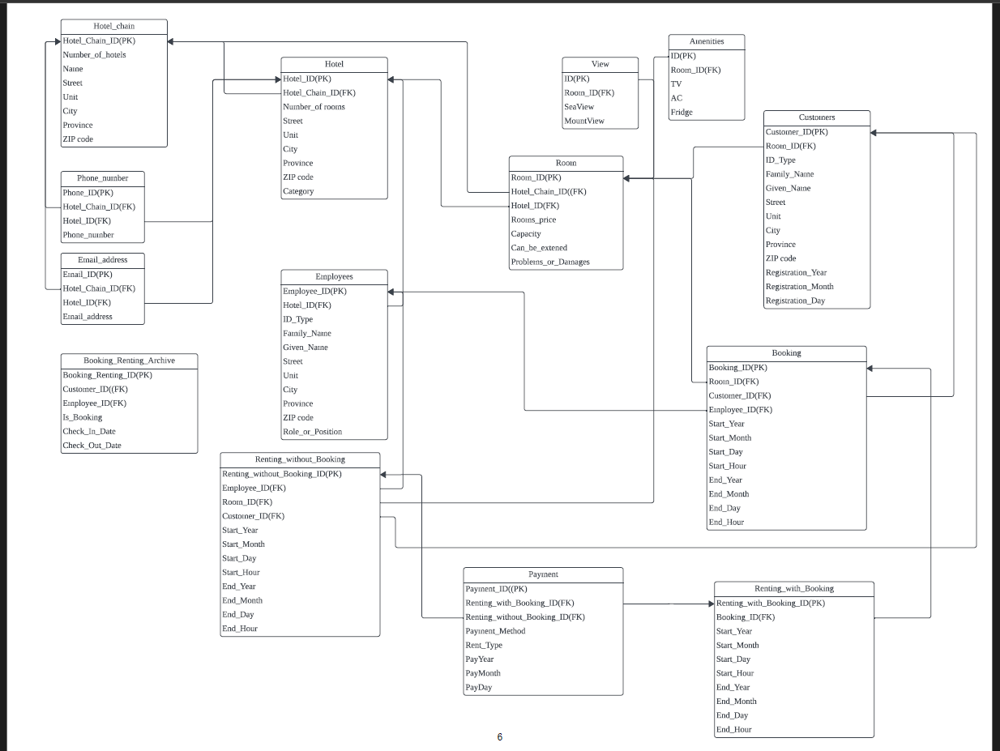

# Hotel Management & Booking Database Design 🗄️

## 📌 Project Overview
This project contains the database design and PostgreSQL database code for a Hotel Management and Booking System. It was built as a group assignment for the **CSI 2132 (Database I) course at the University of Ottawa**. 

The goal of this project was to design and code an organized data system to securely manage information for global hotel chains, physical rooms, customer bookings, employee roles, and customer payments.

---

### 🗺️ Database Structure Diagram
This diagram shows how our 10 database tables link together using matching IDs (Primary Keys and Foreign Keys) to keep our data organized and connected:

---

### 📄 Project Files
All the design blueprints and live database code are included in this folder:

* 🗄️ **[database-setup.sql](./database-setup.sql):** The raw PostgreSQL code script containing all our database tables, input rules, and automated code lines.
* 📁 **[CSI2132_Project_Deliverable_1.pdf](./CSI2132_Project_Deliverable_1.pdf):** Our system design report. It contains our structural database charts and the business rules for our 10 core tables.

---

### 🏛️ Key Database Features & SQL Highlights

The `database-setup.sql` file utilizes advanced SQL capabilities to keep database information fast, accurate, and secure:

* **Automatic Cleanup (`ON DELETE CASCADE`):** We set up cleanup rules between tables. For example, if a parent hotel chain is deleted from the system, all of its hotels and rooms are automatically cleaned up too, preventing broken or missing data records.
* **Smart Input Rules:** We built rules to double-check information before it enters a row (such as verifying Canadian SIN/SSN formats, ensuring a checkout date comes *after* a check-in date, and forcing payment methods to match strict options).
* **Automated Database Triggers:** Written in PL/pgSQL, these functions run automatically behind the scenes to protect data rules (such as ensuring a hotel can only have one active manager, and automatically moving records into a backup archive table).
* **Custom Database Views:** Automated queries that calculate complex data profiles on the fly, like instantly counting live available rooms across different cities or summing total guest capacities per hotel.
* **Relational Search Indexes:** Custom index logs (B-Trees) applied to highly queried columns (like room prices, booking dates, and room status) to help the database find records instantly instead of lagging during high web traffic.

---

### 🔍 Future Improvements (What We Learned)

Looking back at our design, here is how we would improve the system to make it run faster in a real corporate environment:

1. **Simpler Dates:** Our initial design splits dates into separate columns for Year, Month, and Day. In a real system, we would combine these into a single native `TIMESTAMP` column. This saves computer memory and makes it much easier to calculate dates (like calculating how many days a guest stayed).
2. **Removing Redundant Info:** Our `Room` table records both the Hotel ID and the Hotel Chain ID. Since every room belongs to a specific hotel, the database can easily figure out the chain through the hotel itself. Removing the chain ID from the room table saves disk storage.
